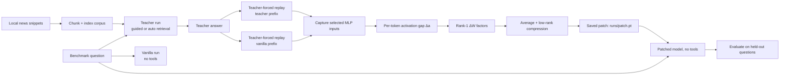
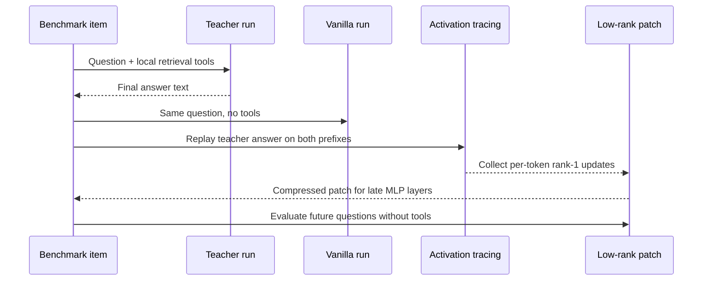

# Agent Tool-Use Distillation via Low-Rank Delta-W

This repository is a compact benchmark for a simple question:

**Can a model first solve a task with tools, then compress that tool-use advantage into a small reusable weight patch so it can answer later without tools?**

The implementation is intentionally small and readable. The canonical entrypoint is the root script, [`agent_tool_distill.py`](agent_tool_distill.py). The checked-in benchmark data is at [`news_snippets.json`](news_snippets.json) and [`news_benchmark.jsonl`](news_benchmark.jsonl).

## TL;DR

The repo builds a local news retrieval corpus, lets a teacher answer questions with retrieval support, compares the teacher's internal activations against a no-tool pass on the same answer tokens, turns those differences into many rank-1 weight updates, compresses them into a low-rank adapter, and reapplies that adapter later so the model can answer without tools. The default runtime is now centered on dense Qwen3 checkpoints, with explicit `non_thinking` and `thinking` profiles and a first-class `sweep` command for model-size ablations.

## Core Idea

There are three distinct phases in the code:

1. **Build a local tool environment.**
   The benchmark news snippets are chunked and indexed with TF-IDF by default, or with a sentence-transformer encoder if you pass `--encoder`.

2. **Trace a teacher and a vanilla model on the same questions.**
   For each `train_new` example, the teacher answers with access to local retrieval, while the vanilla pass sees only the question. The code then forces both contexts to predict the **same final answer text** so the hidden-state comparison is token-aligned.

3. **Convert hidden-state differences into a reusable patch.**
   At the selected MLP linear (`up_proj` by default), the script captures the input activation for every answer token in both runs, computes a per-token rank-1 update, averages many such updates, and compresses them to a rank-`r` patch that can be attached at inference time.

The exact per-token construction used in the script is:

```text
Δa = a_teacher - a_vanilla
u  = W Δa
v  = a_vanilla / ||a_vanilla||^2
ΔW_i = u v^T
```

The collected updates are then compressed with SVD into low-rank factors `left` and `right`. At inference time, `LowRankPatchedLinear` in [`agent_tool_distill.py`](agent_tool_distill.py) adds the learned residual on top of the base linear layer instead of overwriting the original weights.

## Why This Is Only an Approximation

The motivating theorem behind "learning without training" describes a **query-dependent** patch for a particular contextual computation. This repository needs a **static** patch that can be reused across many benchmark questions. So the code makes the simplest practical approximation:

- compute many exact per-token rank-1 updates from teacher traces
- average them
- compress the aggregate to a small reusable low-rank adapter

That makes the benchmark practical, but it is no longer the exact theorem.

## Visualization





## What The Code Implements

| Command | What it does | Main outputs |
| --- | --- | --- |
| `build-corpus` | Chunks [`news_snippets.json`](news_snippets.json) and builds a tiny local vector DB. | `runs/news_corpus/` |
| `fit-patch` | Runs teacher and vanilla passes on `train_new`, captures activation differences, fits low-rank patches over chosen layers. | `runs/patch.pt` |
| `evaluate` | Scores `vanilla`, `teacher`, or `patched` behavior on all benchmark splits. | `runs/eval_*.json` |
| `sweep` | Runs `fit-patch` plus `vanilla`/`teacher`/`patched` evaluation across multiple Qwen3 checkpoints and reasoning modes. | `runs/qwen3/summary.{json,csv,md}` |

Important implementation details:

- Retrieval defaults to TF-IDF, so the corpus build is fully offline and reproducible.
- The default model is `Qwen/Qwen3-1.7B`, and the default ablation ladder is `Qwen/Qwen3-{0.6B,1.7B,4B,8B}`.
- Qwen3 runs support `--reasoning-mode non_thinking` and `--reasoning-mode thinking`; scores and patch fitting use the final visible answer text, while raw thinking text is kept only in trace metadata.
- `Qwen/Qwen3-*-Instruct-2507` checkpoints are non-thinking only, so run them with `--reasoning-mode non_thinking` and do not pass `enable_thinking`.
- The default teacher is `guided`, which always performs one deterministic search before answering.
- `auto` teacher mode is more agentic and uses a lightweight function-calling loop around `search_news` and `read_doc`, with Qwen-compatible tool-call parsing.
- The patch targets `layer.mlp.up_proj` by default because it is the cleanest single-matrix analogue of the first MLP transform in Llama-like models.
- Use `--transformers-src /Volumes/SB-XTM5/flair/software/transformers` to force the local Transformers checkout, and every saved artifact records the resolved import path and version.
- The patch is applied only at inference time; the base model weights on disk are never permanently modified.

## Benchmark Included

The repo ships with a small local benchmark focused on recent AI product and infrastructure announcements.

- Documents: 13 total snippets
- Document splits: 8 `new`, 5 `old`
- QA items: 21 total questions
- QA splits: 8 `train_new`, 8 `eval_new`, 5 `eval_old`

The intended pattern is:

- `teacher` should outperform `vanilla` on `eval_new`
- `patched` should recover part of that gain on `eval_new`
- `patched` should stay close to `vanilla` on `eval_old`

If the patch helps new facts but damages old facts, the main stabilizers are:

- reduce `--rank`
- reduce `--alpha`
- patch fewer late layers, for example `--layers -2,-1`

## Files That Matter

- [`agent_tool_distill.py`](agent_tool_distill.py): root CLI, model loading, tracing, patch fitting, and evaluation.
- [`news_snippets.json`](news_snippets.json): local news corpus used as the retrieval tool backend.
- [`news_benchmark.jsonl`](news_benchmark.jsonl): benchmark questions and splits.
- [`pyproject.toml`](pyproject.toml): `uv` environment definition and console entry point.

There is also an [`agent_tool_distill`](agent_tool_distill) subdirectory that contains a snapshot copy of the same demo assets. The root script and root data files are the ones wired into the `uv` setup documented below.

## Environment Setup With `uv`

The repository now includes a root [`pyproject.toml`](pyproject.toml), so you can create and sync the environment directly with `uv`.

### Prerequisites

- `uv` installed
- Python `3.12` available locally, matching the existing [`.python-version`](.python-version)
- Enough memory for the Qwen3 checkpoint you select; the default sweep targets `0.6B`, `1.7B`, `4B`, and `8B`
- Network access to download model weights from Hugging Face the first time you run a model command

### Setup Steps

1. Enter the repo:

   ```bash
   cd /Volumes/SB-XTM5/flair/software/continual-learning
   ```

2. Install the pinned Python version if needed:

   ```bash
   uv python install 3.12
   ```

3. Create or sync the virtual environment and install dependencies:

   ```bash
   uv sync
   ```

4. If you specifically want 4-bit quantized loading on a Linux CUDA machine, install the optional extra:

   ```bash
   uv sync --extra quantized
   ```

5. Sanity-check the CLI:

   ```bash
   uv run agent-tool-distill --help
   ```

Notes:

- The default install includes `torch`, `transformers`, `accelerate`, `numpy`, `scikit-learn`, and `sentence-transformers`.
- `--load-in-4bit` is not a general default; it depends on `bitsandbytes`, which is mainly useful on Linux CUDA environments.
- If the selected model requires authentication, log in to Hugging Face before running model commands.

### External-Volume Fallback

If the repository lives on a macOS external volume and `uv sync` fails with `._*` sidecar-file errors, keep the virtualenv on your internal disk instead and sync into the active environment.

This was the setup path verified in this environment.

```bash
uv venv "$HOME/.venvs/continual-learning" --python 3.12
source "$HOME/.venvs/continual-learning/bin/activate"
uv sync --active
uv run --active agent-tool-distill --help
```

If you use this fallback, then for the rest of the commands below either:

- keep using `uv run --active agent-tool-distill ...`, or
- activate the environment once and run `agent-tool-distill ...` directly

This Linux CUDA environment was verified with Python `3.12.12`. The previously pinned Python `3.13` path hit a `torch` import bus error here, so the default project pin now targets Python `3.12`.

## Step-By-Step: How To Run The Code

### Path A: Verified local path without model downloads

This path exercises the included benchmark assets and corpus builder without needing a large model.

1. Build the local retrieval corpus:

   ```bash
   uv run agent-tool-distill build-corpus
   ```

   If you used the external-volume fallback, run:

   ```bash
   uv run --active agent-tool-distill build-corpus
   ```

2. Inspect the generated artifacts:

   - `runs/news_corpus/meta.json`
   - `runs/news_corpus/chunks.jsonl`
   - `runs/news_corpus/tfidf.pkl`

This is the part that was verified in this environment via `uv run --active agent-tool-distill build-corpus`.

### Path B: Full end-to-end distillation run

This path requires downloading a compatible Hugging Face causal LM. The default is `Qwen/Qwen3-1.7B`.

1. Build the local corpus:

   ```bash
   uv run agent-tool-distill build-corpus
   ```

2. Fit the low-rank patch on the `train_new` split:

   ```bash
   uv run agent-tool-distill fit-patch \
     --model Qwen/Qwen3-1.7B \
     --transformers-src /Volumes/SB-XTM5/flair/software/transformers \
     --reasoning-mode non_thinking \
     --layers -4,-3,-2,-1 \
     --target up_proj \
     --rank 8 \
     --teacher-mode guided \
     --out runs/patch.pt
   ```

3. Evaluate the no-tool baseline:

   ```bash
   uv run agent-tool-distill evaluate \
     --model Qwen/Qwen3-1.7B \
     --transformers-src /Volumes/SB-XTM5/flair/software/transformers \
     --reasoning-mode non_thinking \
     --mode vanilla \
     --out runs/eval_vanilla.json
   ```

4. Evaluate the tool-using teacher:

   ```bash
   uv run agent-tool-distill evaluate \
     --model Qwen/Qwen3-1.7B \
     --transformers-src /Volumes/SB-XTM5/flair/software/transformers \
     --reasoning-mode non_thinking \
     --mode teacher \
     --teacher-mode guided \
     --out runs/eval_teacher.json
   ```

5. Evaluate the patched model without tools:

   ```bash
   uv run agent-tool-distill evaluate \
     --model Qwen/Qwen3-1.7B \
     --transformers-src /Volumes/SB-XTM5/flair/software/transformers \
     --reasoning-mode non_thinking \
     --mode patched \
     --patch runs/patch.pt \
     --alpha 1.0 \
     --out runs/eval_patched.json
   ```

6. Compare the split-level scores inside the three JSON reports.

### Path C: Dense Qwen3 ablation sweep

This path runs the default dense family sweep over both reasoning modes and writes aggregate reports under `runs/qwen3/`.

```bash
uv run agent-tool-distill sweep \
  --transformers-src /Volumes/SB-XTM5/flair/software/transformers \
  --teacher-mode guided
```

To smoke-test the harness before the full matrix, start with a single checkpoint:

```bash
uv run agent-tool-distill sweep \
  --models Qwen/Qwen3-1.7B \
  --reasoning-modes non_thinking,thinking \
  --transformers-src /Volumes/SB-XTM5/flair/software/transformers \
  --teacher-mode guided
```

Expected reading:

- `eval_teacher.json` should be strongest on `eval_new`
- `eval_patched.json` should improve over `eval_vanilla.json` on `eval_new`
- `eval_patched.json` should remain close to `eval_vanilla.json` on `eval_old`

### Path D: Download and smoke-test `Qwen3-4B-Instruct-2507`

This path downloads the non-thinking Qwen3 instruct checkpoint into a fixed local directory and runs two deterministic `transformers` smoke tests.

```bash
uv run python scripts/download_and_verify_qwen3_instruct.py \
  --checkpoint-dir /content/drive/MyDrive/flair/software/qwen3/checkpoints
```

If you are using the active-environment fallback:

```bash
uv run --active python scripts/download_and_verify_qwen3_instruct.py \
  --checkpoint-dir /content/drive/MyDrive/flair/software/qwen3/checkpoints
```

## Practical Knobs

- Use `--teacher-mode guided` for reproducibility.
- Use `--teacher-mode auto` if you want the model to decide when to call `search_news` or `read_doc`.
- Use `--reasoning-mode` to switch between explicit Qwen3 `non_thinking` and `thinking` profiles.
- Keep `Qwen/Qwen3-*-Instruct-2507` on `--reasoning-mode non_thinking`; those checkpoints are not thinking-enabled.
- Use `--rank` to control patch capacity.
- Use `--alpha` to scale the patch strength at inference time.
- Use `--layers` to choose where the patch is injected.
- Use `--device {auto,mps,cpu,cuda}` to choose the model runtime placement.
- Use `--transformers-src` to pin runs to a specific local Transformers checkout.
- Use `--encoder` on `build-corpus` if you want semantic retrieval instead of TF-IDF.
- Use `--load-in-4bit` only when your hardware and installed extras support it.

## Limitations

- The benchmark uses static local snippets, not live web retrieval.
- The learned patch is a static approximation of a query-dependent effect.
- Only `up_proj` is patched by default. Extending the same mechanism to `gate_proj` is a natural next step.
- The full model-dependent pipeline was not executed in this environment because the required model weights were not already present locally.
